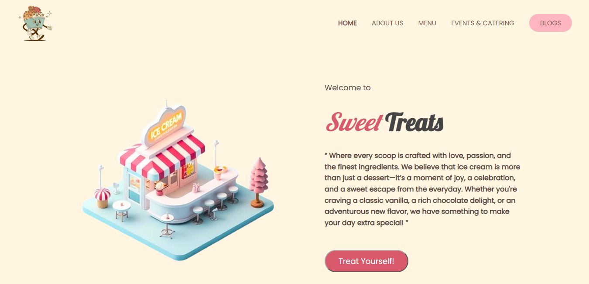

# Sweet Treats
An ice cream website, **Sweet Treats**, where each scoop is full of taste, love, and flavours that make up your day. Get yourself a treat right now; go and visit our official website 👉 [Sweet Treats](https://yuisurbhi.github.io/sweet-treats/)

## Screenshot 

## Features
* Explore a variety of ice cream flavours through our menu.
* Learn more about our story and values through the About Us section.
* Discover our event and catering services.
* Read our blogs to explore more about ice cream and our treats.
* Enjoy a simple and visually appealing ice cream website experience.
* We made the website responsive so it can be viewed on phones, tablets, and desktops.

## Collaborative Project

Sweet Treats is a collaborative project built together with a fellow developer. We worked on different parts of the website and used GitHub branches and pull requests to manage changes and merge our work into the main branch.

## Collaboration & Learning

Working on this project helped us learn how to collaborate using GitHub, manage changes, and work together on the same project. It also gave us experience in building and improving a website as a team.

## Live Website

[Sweet Treats](https://yuisurbhi.github.io/sweet-treats/)

## Contributors

* **Surbhi Verma** — [@YuiSurbhi](https://github.com/YuiSurbhi)
* **Pedini Jayashree** — [@pedinistar](https://github.com/pedinistar)
